# Самок-Аах-т - backend

[Смотреть документацию](documentation.md)

>Приложение «Самок-Аах-т» предназначено для поиска и заказа стриптизёров и стриптизерш. Пользователи системы делятся на три роли: 
> * Client, который может регистрироваться, искать услуги моделей, видит слоты и их статусы, может бронировать конкретный слот с выбором услуги и указанием адреса оказания услуги, отменять бронь или заказ за не менее, чем 24 часа; 
> * Model, которая может регистрироваться, публиковать услуги с описанием и ценами, создавать слоты доступности и управлять ими, просматривать бронирования и заказы по своим услугам, подтверждать или отклонять брони, завершать заказ (как в Яндекс такси) и отменять его за не менее, чем 24 часа; 
> * Admin, у которого полные права: управляет пользователями (верификация данных - возраст 18+), имеет доступ ко всем пользователям, броням и заказам, может отменять брони и заказы в исключительных случаях, включая ситуации менее чем за 24 часа до времени оказания услуги.

верификация данных - возраст 18+ - можно было и просто тупо как бизнес правило проверять, но на практике там вводились бы паспортные данные и если все не автоматизировано, то админ бы проверял вручную. ну а я пока для простоты просто ему даю возможность "поиграться" и чисто по введенному возрасту пользователем верифицировать.

*Представим, что сервис работает только внутри какого-то города N.

| Story ID | Краткое описание                                           | Эндпоинты                           | Критерии приёмки (GWT)                                                                                                                                                                            | Бизнес-правила                                                                                                                                                                                                 | Юнит-тесты                       | Негативные кейсы                                                                                |
|----------|------------------------------------------------------------|-------------------------------------|---------------------------------------------------------------------------------------------------------------------------------------------------------------------------------------------------|----------------------------------------------------------------------------------------------------------------------------------------------------------------------------------------------------------------|----------------------------------|-------------------------------------------------------------------------------------------------|
| ST-1     | Модель создаёт услугу                                      | POST /model/services                | **Given** роль=model и model.verified=true – **When** POST /model/services с валидным payload – **Then** 201 Created.                                                                             | Только верифицированная model может публиковать услуги; цена > 0; описание ≤ 1000 символов.                                                                                                                    | TestCreateService_Success        | 403 – модель не верифицирована; 422 – цена ≤ 0                                                  |
| ST-2     | Модель создаёт слот                                        | POST /model/slots                   | **Given** роль=model и model.verified=true – **When** POST /model/slots с валидным payload – **Then** 201 Created.                                                                                | Только верифицированная model может создавать слоты; слот не в прошлом; слот не пересекается с другими слотами этой модели; start < end.                                                                       | TestCreateSlot_Success           | 403 – модель не верифицирована; 409 – слот пересекается в другими слотами модели                |
| ST-3     | Модель деактивирует (отключает для бронирования) слот      | PATCH /model/slots/{slotId}/disable | **Given** роль=model и модель=владелец слота – **When** PATCH /model/slot/{slotId}/disable – **Then** 200 OK и слот в status=Disabled.                                                            | Слот можно перевести в Disabled только моделью-владельцем; если уже создана бронь или уже слот забронирован (заказ создан), то данный статус невозможен.                                                       | TestDisableSlot_Success          | 403 – не владелец слота; 409 – слот уже Disabled; 409 – есть активная бронь                     |
| ST-4     | Модель просматривает свои заказы                           | GET /model/orders                   | **Given** роль=model – **When** GET /model/orders – **Then** 200 OK и список заказов модели.                                                                                                      | Модель видит только заказы на свои услуги; пагинация.                                                                                                                                                          | TestGetModelOrders_Success       | 403 – не model; 401 – без аутентификации                                                        |
| ST-5     | Модель подтверждает бронь                                  | PATCH /model/bookings/{id}/approve  | **Given** роль=model, бронь в status=Pending и модель=владелец услуги – **When** PATCH /model/bookings/{id}/approve – **Then** 200 OK, бронь в status=Approved и создан Order в status=Confirmed. | Только модель=владелец услуги может подтвердить бронь; подтверждение брони автоматически создаёт заказ; один booking = один order; после Approved слот считается занятым окончательно и у слота status=Booked. | TestApproveBooking_CreateOrder   | 403 – не владелец услуги; 409 – бронь уже обработана                                            |
| ST-6     | Модель отклоняет бронь                                     | PATCH /model/bookings/{id}/reject   | **Given** роль=model и бронь в status=Pending – **When** PATCH /model/bookings/{id}/reject – **Then** 200 OK и бронь в status=Rejected.                                                           | Заказ не создаётся; слот освобождается.                                                                                                                                                                        | TestRejectBooking_NotCreateOrder | 403 – не владелец услуги; 409 – бронь уже обработана                                            |
| ST-7     | Модель отменяет заказ                                      | PATCH /model/orders/{id}/cancel     | **Given** роль=model, заказ в status=Confirmed или InTransit и модель=владелец услуги – **When** PATCH /model/orders/{id}/cancel – **Then** 200 OK и заказ в status=Cancelled.                    | Модель может отменить только свой заказ не менее чем за 24 часа до времени заказа; при отмене заказа связанная бронь переводится в status=Cancelled.                                                           | TestCancelOrder_ByModel          | 403 – попытка отмены чужого заказа; 409 – попытка отмены менее чем за 24 часа до времени заказа |
| ST-8     | Завершение заказа (модель подтверждает оказание услуги)    | PATCH /model/orders/{id}/complete   | **Given** роль=model и заказ в status=InTransit и текущее время >= времени заказа – **When** PATCH /model/orders/{id}/complete – **Then** 200 OK и status=Completed.                              | Заказ может быть переведён в status=Completed только из статуса InTransit и только моделью – владельцем услуги, после времени окончания заказа.                                                                | TestOrderStatus_Completed        | 400 – недопустимый переход                                                                      |
| ST-9     | Клиент просматривает список услуг                          | GET /client/services                | **Given** услуги существуют – **When** GET /client/services – **Then** 200 OK и пагинация.                                                                                                        | Пагинация: limit ≤ max_limit.                                                                                                                                                                                  | TestServiceList_Pagination       | 400 – некорректные параметры пагинации, фильтрации                                              |
| ST-10    | Клиент просматривает услугу                                | GET /client/services/{id}           | **Given** услуга существует – **When** GET /client/services/{id} – **Then** 200 OK.                                                                                                               | Услуга должна существовать.                                                                                                                                                                                    | TestGetServiceByID_Success       | 404 – услуга не найдена                                                                         |
| ST-11    | Клиент бронирует слот                                      | POST /client/bookings               | **Given** роль=client, услуга существует и слот свободен – **When** POST /client/bookings – **Then** 201 Created и status=Pending.                                                                | Нельзя создавать пересекающиеся брони; у слота status=Available становится status=Reserved; бронь создаётся со статусом Pending.                                                                               | TestCreateBooking_Pending        | 409 – слот занят; 422 – дата в прошлом                                                          |
| ST-12    | Клиент отменяет бронь                                      | PATCH /client/bookings/{id}/cancel  | **Given** роль=client, бронь в status=Pending и client=владелец – **When** PATCH /client/bookings/{id}/cancel – **Then** 200 OK и status=Cancelled.                                               | Клиент может отменить только свою бронь и только до подтверждения моделью.                                                                                                                                     | TestBookingStatus_Cancelled      | 403 – попытка отмены чужой брони; 409 – попытка отмены брони не в status=Pending                |
| ST-13    | Клиент отменяет заказ                                      | PATCH /client/orders/{id}/cancel    | **Given** роль=client, заказ в status=Confirmed и client=владелец – **When** PATCH /client/orders/{id}/cancel с payload: status=cancelled – **Then** 200 OK и status=Cancelled.                   | Клиент может отменить только свой заказ не менее чем за 24 часа до времени заказа; при отмене заказа связанная бронь переводится в status=Cancelled.                                                           | TestCancelOrder_ByClient         | 403 – попытка отмены чужого заказа; 409 – попытка отмены менее чем за 24 часа до времени заказа |
| ST-14    | Админ просматривает профили юзеров                         | GET /admin/users                    | **Given** роль=admin и модель существует – **When** GET /admin/users – **Then** 200 OK и список всех пользователей с их персональной информацией и пагинация.                                     | Только admin может видеть всю персональную информацию юзера(модели/клиента).                                                                                                                                   | TestGetAllUsers_ByAdmin          | 403 – не admin                                                                                  |
| ST-15    | Админ верифицирует юзера (модель/клиент) (возраст 18+)     | PATCH /admin/users/{id}/verify      | **Given** роль=admin и юзер существует – **When** PATCH /admin/users/{id}/verify – **Then** 200 OK и user.verified=true.                                                                          | Только admin может верифицировать юзера.                                                                                                                                                                       | TestVerifyUser_ByAdmin           | 403 – не admin; 404 – юзер не найден                                                            |
| ST-16    | Админ просматривает все заказы                             | GET /admin/orders                   | **Given** роль=admin – **When** GET /admin/orders – **Then** 200 OK и список всех заказов и пагинация.                                                                                            | Админ имеет доступ ко всем заказам.                                                                                                                                                                            | TestGetAllOrders_ByAdmin         | 403 – не admin                                                                                  |
| ST-17    | Админ просматривает все брони                              | GET /admin/bookings                 | **Given** роль=admin – **When** GET /admin/bookings – **Then** 200 OK и список всех броней и пагинация.                                                                                           | Админ имеет доступ ко всем броням.                                                                                                                                                                             | TestGetAllBookings_ByAdmin       | 403 – не admin                                                                                  |
| ST-18    | Админ отменяет бронь (возможно и при менее чем за 24 часа) | PATCH /admin/bookings/{id}/status   | **Given** роль=model/client и заказ может быть <24h – **When** PATCH /admin/bookings/{id}/status с payload: status=cancelled – **Then** 200 OK и status=Cancelled.                                | Админ имеет право отменить бронь в крайнем случае и даже менее чем за 24 часа.                                                                                                                                 | TestCancelBooking_ByAdmin        | 403 – не admin                                                                                  |
| ST-19    | Админ отменяет заказ (возможно и при менее чем за 24 часа) | PATCH /admin/orders/{id}/status     | **Given** роль=model/client и заказ может быть <24h – **When** PATCH /admin/orders/{id}/status с payload: status=cancelled – **Then** 200 OK и status=Cancelled.                                  | Админ имеет право отменить заказ в крайнем случае и даже менее чем за 24 часа.                                                                                                                                 | TestCancelOrder_ByAdmin          | 403 – не admin                                                                                  |

___

*Статусы слота = Available/Reserved/Booked/Disabled

*Статусы брони = Pending/Rejected/Approved/Cancelled/Expired

*Статусы заказа = Confirmed/InTransit/Completed/Cancelled

*Заказ создаётся автоматически только после перехода брони в статус Approved.
___

*/metrics реализован как отдельный HTTP endpoint на уровне API Layer в Component diagram и используется Prometheus для сбора метрик. Метрики регистрируются внутри service layer с помощью Prometheus client.

```mermaid
C4Component
    Container_Boundary(api, "HTTP API Layer") {
        Component(authMiddleware, "AuthMiddleware", "Middleware", "Извлекает JWT, вызывает AuthService для проверки токена и ролей (client, model, admin)")
        Component(authHandler, "AuthHandler", "HTTP Handler", "Ручки логина и регистрации пользователей")
        Component(userHandler, "UserHandler", "HTTP Handler", "Управление профилем клиента/модели")
        Component(serviceHandler, "ServiceHandler", "HTTP Handler", "Управление услугами моделей")
        Component(slotHandler, "SlotHandler", "HTTP Handler", "Управление слотами моделей")
        Component(bookingHandler, "BookingHandler", "HTTP Handler", "Создание и управление бронями")
        Component(orderHandler, "OrderHandler", "HTTP Handler", "Управление заказами")
        Component(adminHandler, "AdminHandler", "HTTP Handler", "Административные функции")
        Component(metricsEndpoint, "/metrics", "HTTP Endpoint", "Экспорт метрик для Prometheus")
    }

    Container_Boundary(services, "Service Layer") {
        Component(authService, "AuthService", "Service", "Бизнес-логика логина, регистрации и проверки токенов")
        Component(userService, "UserService", "Service", "Доменные правила профиля и верификации моделей")
        Component(serviceService, "ServiceService", "Service", "Валидация и управление услугами моделей")
        Component(slotService, "SlotService", "Service", "Управление слотами моделей")
        Component(bookingService, "BookingService", "Service", "Управление бронированиями")
        Component(orderService, "OrderService", "Service", "Управление заказами и их жизненным циклом исполнения")
        Component(adminService, "AdminService", "Service", "Административные сценарии")
        Component(metricsService, "MetricsService", "Service / Prometheus Client", "Сбор и предоставление метрик")
    }

    Container_Boundary(repositories, "Repository Layer") {
        ComponentDb(authRepo, "AuthRepository", "Repository", "Учётные данные, пароли")
        ComponentDb(userRepo, "UserRepository", "Repository", "Доступ к данным пользователей (клиентов и моделей)")
        ComponentDb(adminRepo, "AdminRepository", "Repository", "Сущности администраторов и их права")
        ComponentDb(serviceRepo, "ServiceRepository", "Repository", "Услуги моделей")
        ComponentDb(slotRepo, "SlotRepository", "Repository", "Доступ к данным слотов моделей")
        ComponentDb(bookingRepo, "BookingRepository", "Repository", "Бронирования")
        ComponentDb(orderRepo, "OrderRepository", "Repository", "Заказы")
    }

    SystemDb(db, "PostgreSQL Database")
    System_Ext(prometheus, "Prometheus", "Система сбора метрик")

    Rel(authHandler, authService, "использует")
    Rel(userHandler, userService, "использует")
    Rel(serviceHandler, serviceService, "использует")
    Rel(slotHandler, slotService, "использует")
    Rel(bookingHandler, bookingService, "использует")
    Rel(orderHandler, orderService, "использует")
    Rel(adminHandler, adminService, "использует")

    Rel(authMiddleware, authService, "валидация токена и роли")

    Rel(authService, authRepo, "чтение/запись данных входа")
    Rel(userService, userRepo, "чтение/запись данных профиля")
    Rel(adminService, adminRepo, "чтение/запись администраторов")
    
    Rel(serviceService, serviceRepo, "чтение/запись услуг")
    
    Rel(slotService, slotRepo, "чтение/запись слотов")
    Rel(slotService, bookingRepo, "проверка активных броней")
    
    Rel(bookingService, bookingRepo, "чтение/запись бронирований")
    Rel(bookingService, orderService, "создание заказа")
    Rel(bookingService, slotRepo, "проверка, резервирование и освобождение слотов")
    
    Rel(orderService, orderRepo, "чтение/запись заказов")
    Rel(orderService, bookingRepo, "обновление связанной брони")
    
    Rel(adminService, userRepo, "верификация пользователей")
    Rel(adminService, orderRepo, "чтение/правка заказов")
    Rel(adminService, bookingRepo, "чтение/правка броней")

    Rel(authRepo, db, "читает/пишет")
    Rel(userRepo, db, "читает/пишет")
    Rel(adminRepo, db, "читает/пишет")
    Rel(serviceRepo, db, "читает/пишет")
    Rel(slotRepo, db, "читает/пишет")
    Rel(bookingRepo, db, "читает/пишет")
    Rel(orderRepo, db, "читает/пишет")

    Rel(authService, metricsService, "обновляет метрики")
    Rel(userService, metricsService, "обновляет метрики")
    Rel(serviceService, metricsService, "обновляет метрики")
    Rel(bookingService, metricsService, "обновляет метрики")
    Rel(orderService, metricsService, "обновляет метрики")
    Rel(adminService, metricsService, "обновляет метрики")

    Rel(metricsService, metricsEndpoint, "предоставляет метрики для Prometheus")
    Rel(prometheus, metricsEndpoint, "собирает метрики")
```

